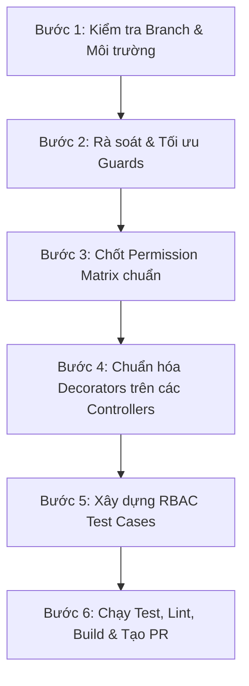

# Hướng dẫn thực hiện Task 10: RBAC (Role-Based Access Control)
> **Người thực hiện:** KienTT (BE)  
> **Sprint:** Sprint 1 | **Priority:** HIGH | **Dependencies:** Auth  
> **Branch làm việc:** `feature/rbac`  
> **Tiêu chí hoàn thành (Acceptance Criteria):**
> 1. Danh sách route + role expected (Permission Matrix) được rà soát và chốt 100% trên toàn hệ thống.
> 2. Rà soát & chuẩn hóa toàn bộ Guard (`JwtAuthGuard`, `ProjectRoleGuard`, `SystemRoleGuard`) và Decorator (`@Public`, `@SystemRoles`, `@ProjectRoles`).
> 3. Loại bỏ việc hardcode quyền trong Controller theo đúng quy định tại `docs/TEAM_RULES.md`.
> 4. Xây dựng bộ test cases kiểm thử ma trận phân quyền (Permission Matrix Test Cases) đảm bảo bảo mật chặt chẽ.

---

## 1. Tổng quan Kiến trúc RBAC 2 Tầng trong TTeamFlow

Hệ thống quản lý phân quyền theo 2 tầng độc lập:
1. **Tầng 1 - Cấp hệ thống (`SystemRole`):**
   - `ADMIN`: Quản trị viên toàn hệ thống, có quyền truy cập module `/admin/*`. Lưu ý: Admin **không tự động** có quyền thao tác dữ liệu nội bộ trong từng project nếu không phải là thành viên.
   - `USER`: Người dùng thông thường trong hệ thống.
2. **Tầng 2 - Cấp dự án (`ProjectRole`):**
   - `OWNER`: Người tạo/sở hữu dự án (Toàn quyền, bao gồm xóa dự án, giải tán thành viên).
   - `MANAGER`: Quản lý dự án (Quản lý thành viên, cấu hình cột Kanban, quản lý task). *Lưu ý: Không được quản lý hoặc hạ quyền của OWNER, không được xóa project*.
   - `MEMBER`: Thành viên dự án (Tạo, cập nhật, di chuyển task, viết checklist, comment). Không có quyền quản lý thành viên hay cấu hình cột.
   - `VIEWER`: Thành viên chỉ đọc (Chỉ xem Dashboard, Kanban, Task, Activity Log). Mọi thao tác ghi/sửa/xóa đều bị từ chối (`403 Forbidden`).

---

## 2. Các bước thực hiện chi tiết từ đầu đến cuối



---

### Bước 1: Kiểm tra Git Branch & Cấu hình môi trường

Đảm bảo bạn đang ở đúng branch và code base mới nhất:
```bash
# Kiểm tra nhánh hiện tại
git branch

# Đảm bảo đang ở nhánh feature/rbac (hoặc tạo mới từ develop)
git checkout feature/rbac

# Cài đặt thư viện (nếu chưa cài)
cd backend
npm install
```

---

### Bước 2: Rà soát & Tối ưu Core Guards & Decorators

Các guard hiện tại nằm trong thư mục `backend/src/common/guards/`:

1. **`JwtAuthGuard` (`common/guards/jwt-auth.guard.ts`)**:
   - Đã được đăng ký làm `APP_GUARD` toàn cục trong `AuthModule`.
   - Mặc định bảo vệ mọi endpoint, ngoại trừ endpoint có đánh dấu `@Public()`.
   - **Cần kiểm tra:** Các route công khai như `/auth/login`, `/auth/register`, `/health` phải có `@Public()`.

2. **`SystemRoleGuard` (`common/guards/system-role.guard.ts`)**:
   - Được đăng ký làm `APP_GUARD`.
   - Đọc metadata từ `@SystemRoles(...)`.
   - Nếu user không có role tương ứng -> Ném `ForbiddenException("Bạn không có quyền hệ thống phù hợp")`.

3. **`ProjectRoleGuard` (`common/guards/project-role.guard.ts`)**:
   - Được đăng ký làm `APP_GUARD`.
   - Đọc metadata từ `@ProjectRoles(...)`.
   - Lấy `projectId` từ `request.params.projectId ?? request.params.id`.
   - **Điểm cần rà soát & khắc phục:**
     - Với các route có param dạng `:projectId` (ví dụ: `/projects/:projectId/members`, `/projects/:projectId/kanban`, `/projects/:projectId/dashboard`), guard kiểm tra quyền tự động rất tốt.
     - Tuy nhiên, với các route thao tác qua entity ID trực tiếp như `/tasks/:taskId` hoặc `/checklists/:id`, `request.params` không chứa `projectId`. Vì vậy, guard sẽ bỏ qua nếu không có `@ProjectRoles` hoặc báo lỗi nếu không tìm thấy `projectId`.
     - **Giải pháp chuẩn:** 
       - Các route ở cấp Project (`/projects/:projectId/...`): **Bắt buộc dùng `@ProjectRoles(...)`**.
       - Các route cấp Entity phụ thuộc (`/tasks/:taskId`, `/checklists/:id`): Việc kiểm tra quyền `member.role !== VIEWER` phải được thực hiện nhất quán trong `Service`, **không được viết lộn xộn/hardcode logic query trực tiếp trong Controller**.

---

### Bước 3: Chốt Ma trận Phân quyền Chuẩn (Permission Matrix)

Dưới đây là ma trận phân quyền chính thức được chuẩn hóa theo `docs/API_REQUEST_RESPONSE.md`:

| STT | Endpoint / Action | Method | Route | Yêu cầu SystemRole | Yêu cầu ProjectRole | Mã lỗi kỳ vọng |
|:---:|:---|:---:|:---|:---:|:---:|:---:|
| **1** | Đăng ký tài khoản | `POST` | `/api/v1/auth/register` | `@Public()` | N/A | `400` nếu trùng email |
| **2** | Đăng nhập | `POST` | `/api/v1/auth/login` | `@Public()` | N/A | `401` nếu sai pass |
| **3** | Refresh token / Logout | `POST` | `/api/v1/auth/refresh`, `/logout` | Any authenticated | N/A | `401` |
| **4** | Xem / Sửa profile cá nhân | `GET/PATCH` | `/api/v1/users/me` | Any authenticated | N/A | `401` |
| **5** | Admin: Danh sách / Khóa user | `GET/PATCH` | `/api/v1/admin/users/*` | `ADMIN` | N/A | `403` nếu là `USER` |
| **6** | Lấy danh sách project của tôi | `GET` | `/api/v1/projects` | Any authenticated | N/A (chỉ lấy project user tham gia) | `401` |
| **7** | Tạo mới project | `POST` | `/api/v1/projects` | Any authenticated | N/A (người tạo tự động làm OWNER) | `401` |
| **8** | Xem chi tiết project | `GET` | `/api/v1/projects/:projectId` | Any | `OWNER, MANAGER, MEMBER, VIEWER` | `403` nếu không thuộc project |
| **9** | Cập nhật project (tên, mô tả...) | `PATCH` | `/api/v1/projects/:projectId` | Any | `OWNER, MANAGER` | `403` nếu là MEMBER/VIEWER |
| **10** | Lưu trữ / Khôi phục project | `PATCH` | `/api/v1/projects/:projectId/archive`, `/restore` | Any | `OWNER, MANAGER` | `403` nếu là MEMBER/VIEWER |
| **11** | Xóa project vĩnh viễn | `DELETE` | `/api/v1/projects/:projectId` | Any | `OWNER` (Duy nhất) | `403` nếu là MANAGER/MEMBER/VIEWER |
| **12** | Xem danh sách thành viên | `GET` | `/api/v1/projects/:projectId/members` | Any | `OWNER, MANAGER, MEMBER, VIEWER` | `403` nếu người ngoài |
| **13** | Thêm thành viên mới | `POST` | `/api/v1/projects/:projectId/members` | Any | `OWNER, MANAGER` | `403` nếu là MEMBER/VIEWER |
| **14** | Đổi vai trò thành viên | `PATCH` | `/api/v1/projects/:projectId/members/:userId` | Any | `OWNER, MANAGER` *(MANAGER không được đổi OWNER)* | `403` |
| **15** | Xóa thành viên khỏi project | `DELETE` | `/api/v1/projects/:projectId/members/:userId` | Any | `OWNER, MANAGER` *(MANAGER không được xóa OWNER)* | `403` |
| **16** | Xem bảng Kanban | `GET` | `/api/v1/projects/:projectId/kanban` | Any | `OWNER, MANAGER, MEMBER, VIEWER` | `403` nếu người ngoài |
| **17** | Quản lý cột Kanban (Thêm/Sửa/Xóa/Sắp xếp) | `POST/PATCH/DELETE` | `/api/v1/projects/:projectId/columns/*` | Any | `OWNER, MANAGER` | `403` nếu là MEMBER/VIEWER |
| **18** | Tạo task mới | `POST` | `/api/v1/projects/:projectId/tasks` | Any | `OWNER, MANAGER, MEMBER` | `403` nếu là VIEWER |
| **19** | Xem chi tiết task | `GET` | `/api/v1/tasks/:taskId` | Any | Thuộc project chứa task | `403` nếu không thuộc project |
| **20** | Cập nhật / Di chuyển task | `PATCH` | `/api/v1/tasks/:taskId`, `/move` | Any | `OWNER, MANAGER, MEMBER` | `403` nếu là VIEWER |
| **21** | Xóa task | `DELETE` | `/api/v1/tasks/:taskId` | Any | `OWNER, MANAGER, MEMBER` | `403` nếu là VIEWER |
| **22** | Thêm / Sửa / Xóa checklist | `POST/PATCH/DELETE` | `/api/v1/tasks/:taskId/checklists`, `/checklists/:id` | Any | `OWNER, MANAGER, MEMBER` | `403` nếu là VIEWER |
| **23** | Xem Dashboard dự án | `GET` | `/api/v1/projects/:projectId/dashboard` | Any | `OWNER, MANAGER, MEMBER, VIEWER` | `403` nếu người ngoài |
| **24** | Xem Activity Logs | `GET` | `/api/v1/projects/:projectId/activity-logs` | Any | `OWNER, MANAGER, MEMBER, VIEWER` | `403` nếu người ngoài |

---

### Bước 4: Rà soát & Chuẩn hóa Code Controller

#### 1. Rà soát `ProjectsController` (`src/modules/projects/projects.controller.ts`)
- **Vấn đề phát hiện:** Endpoint `GET /projects/:projectId` hiện tại **chưa gắn `@ProjectRoles`**, làm cho việc kiểm tra quyền phụ thuộc hoàn toàn vào service `findOne`.
- **Hành động cần làm:** Bổ sung decorator:
  ```typescript
  @ProjectRoles(
    ProjectRole.OWNER,
    ProjectRole.MANAGER,
    ProjectRole.MEMBER,
    ProjectRole.VIEWER,
  )
  @Get(":projectId")
  findOne(@Param("projectId") projectId: string, @CurrentUser() user: AuthUser) {
    return this.projectsService.findOne(projectId, user.id);
  }
  ```

#### 2. Rà soát `TasksController` (`src/modules/tasks/tasks.controller.ts`)
- **Vấn đề phát hiện:** Tại hàm `move`, controller đang trực tiếp truy vấn Prisma (`this.prisma.projectMember.findUnique`) để kiểm tra quyền:
  *(Vi phạm điều cấm tại `docs/TEAM_RULES.md`: "Không được hardcode role permission trong nhiều controller")*.
- **Hành động cần làm:** Di chuyển logic kiểm tra quyền vào `tasks.service.ts` bên trong phương thức `move(taskId, actorId, dto)`. Controller chỉ làm nhiệm vụ điều hướng dữ liệu.

#### 3. Rà soát `ActivityLogsController` (`src/modules/activity-logs/activity-logs.controller.ts`)
- **Vấn đề phát hiện:** Đối chiếu với Permission Matrix (Mục 13 `API_REQUEST_RESPONSE.md`): Activity logs cho phép `MEMBER` và `VIEWER` được xem để theo dõi tiến độ công việc, nhưng controller hiện tại chỉ cho `OWNER, MANAGER`.
- **Hành động cần làm:** Thống nhất với team và cập nhật `@ProjectRoles`:
  ```typescript
  @ProjectRoles(
    ProjectRole.OWNER,
    ProjectRole.MANAGER,
    ProjectRole.MEMBER,
    ProjectRole.VIEWER,
  )
  ```

---

### Bước 5: Xây dựng Bộ Test Cases Kiểm thử Phân quyền (RBAC Test Suite)

Tạo file test tích hợp tại `backend/test/rbac.e2e-spec.ts` để tự động hóa việc xác minh quyền:

#### Kịch bản dữ liệu mẫu cần chuẩn bị (Test Fixtures):
1. **User 1 (Admin):** `systemRole: ADMIN`
2. **User 2 (Owner):** Thành viên dự án với `role: OWNER`
3. **User 3 (Manager):** Thành viên dự án với `role: MANAGER`
4. **User 4 (Member):** Thành viên dự án với `role: MEMBER`
5. **User 5 (Viewer):** Thành viên dự án với `role: VIEWER`
6. **User 6 (Outsider):** User đã đăng nhập nhưng không có trong dự án
7. **Khách (Anonymous):** Không gửi Bearer Token

#### Ma trận Test Cases bắt buộc chạy:
* [x] **TC-01 (Anonymous):** Gọi bất kỳ API dự án nào không kèm token $\rightarrow$ Nhận `401 Unauthorized`.
* [x] **TC-02 (Outsider):** User 6 gọi `GET /api/v1/projects/:projectId` $\rightarrow$ Nhận `403 Forbidden`.
* [x] **TC-03 (System Role):** User 2 (role `USER`) cố gọi `GET /api/v1/admin/users` $\rightarrow$ Nhận `403 Forbidden`.
* [x] **TC-04 (Viewer Read-Only):** User 5 (`VIEWER`) xem được kanban, nhưng gọi `POST /api/v1/projects/:projectId/tasks` $\rightarrow$ Nhận `403 Forbidden`.
* [x] **TC-05 (Member Boundary):** User 4 (`MEMBER`) tạo được task, nhưng gọi `POST /api/v1/projects/:projectId/columns` (quản lý cột) hoặc `DELETE /api/v1/projects/:projectId` $\rightarrow$ Nhận `403 Forbidden`.
* [x] **TC-06 (Manager Boundary):** User 3 (`MANAGER`) quản lý được task và thêm member, nhưng gọi `DELETE /api/v1/projects/:projectId` $\rightarrow$ Nhận `403 Forbidden`.
* [x] **TC-07 (Manager vs Owner):** User 3 (`MANAGER`) cố hạ quyền hoặc xóa User 2 (`OWNER`) khỏi project $\rightarrow$ Nhận `403 Forbidden`.
* [x] **TC-08 (Owner Full Access):** User 2 (`OWNER`) thực hiện thành công mọi thao tác trong dự án $\rightarrow$ Nhận `200/201`.

---

### Bước 6: Kiểm tra, Build và Tạo Pull Request

Sau khi hoàn thiện code và test:

1. **Chạy kiểm tra TypeScript và Linter:**
   ```bash
   cd backend
   npx tsc --noEmit
   npm run lint
   ```

2. **Chạy Build ứng dụng:**
   ```bash
   npm run build
   ```

3. **Chạy bộ test:**
   ```bash
   npm run test
   ```

4. **Commit & Push theo đúng Convention:**
   ```bash
   git add .
   git commit -m "feat(rbac): KienTT complete permission matrix audit, guards optimization and test cases"
   git push origin feature/rbac
   ```

5. **Tạo Pull Request:**
   - Base branch: `develop`
   - Compare branch: `feature/rbac`
   - Mô tả PR đính kèm bảng Permission Matrix và kết quả chạy test case.

