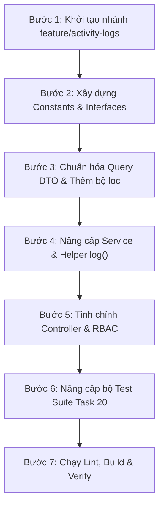

# Hướng dẫn thực hiện Task 20: Chuẩn hóa Activity Logs
> **Người thực hiện:** KienTT (BE)  
> **Sprint:** Sprint 2 | **Priority:** MED | **Module:** Activity Logs  
> **Branch làm việc:** `feature/activity-logs` (tạo từ `develop`)  
> **Tiêu chí hoàn thành (Acceptance Criteria):**
> 1. **Chuẩn hóa Action Enum & Entity Types:** Định nghĩa đầy đủ `ActivityAction` và `ActivityEntityType` chuẩn mực cho toàn hệ thống.
> 2. **Metadata Contract:** Định kiểu dữ liệu chặt chẽ (TypeScript interfaces) cho `metadata` của từng loại sự kiện thuộc `Projects`, `Tasks`, `Members`, `Kanban`.
> 3. **GET Paginated Activity Logs API:** Endpoint `GET /api/v1/projects/:projectId/activity-logs` trả về định dạng chuẩn `{ success: true, data: [...], meta: { page, limit, total, totalPages } }`, hỗ trợ bộ lọc tùy chọn theo `action` và `entityType`.
> 4. **Append-Only Assurance:** Module đảm bảo tuyệt đối tính chất ghi nhận bất biến (append-only), không có API hoặc method nào cho phép chỉnh sửa (update) hay xóa (delete) activity logs.
> 5. **Bảo mật & Phân quyền (RBAC):** Cấu hình đúng ma trận phân quyền: `OWNER`, `MANAGER`, `MEMBER`, `VIEWER` đều có quyền xem log dự án; người ngoài dự án bị từ chối truy cập (`403 Forbidden`).
> 6. **Zero Conflict Strategy:** Tuyệt đối không can thiệp vào các file mã nguồn thuộc quyền sở hữu của thành viên khác (QuanNH, PhongVV), bảo đảm an toàn 100% khi merge vào `develop`.
> 7. **Automated Test Suite:** Xây dựng bộ test case toàn diện kiểm thử đầy đủ các tiêu chí trên.

---

## 1. Phân tích tác động & Chiến lược phòng chống Merge Conflict (Zero-Conflict Strategy)

Theo tài liệu phân công [docs/TEAM_WORK_PLAN.md](file:///d:/GitHub/TTeamFlow/docs/TEAM_WORK_PLAN.md) (Mục 6: Shared ownership):
- **PhongVV** phụ trách: `Kanban / Tasks / Checklist / Comments` (sở hữu `tasks/`, `kanban/`).
- **QuanNH** phụ trách: `Auth / Projects / Members` (sở hữu `project-members/`, `projects/`).
- **KienTT** sở hữu: `Activity Logs`, `Dashboard`, `Admin`, `RBAC`.
- **Nguyên tắc chia sẻ:** *"KienTT sở hữu module log, nhưng QuanNH/PhongVV phải ghi log trong business flow của feature mình làm."*

> [!IMPORTANT]
> **Cam kết không gây conflict (Zero-Conflict Isolation):**
> Nếu KienTT sửa trực tiếp vào file `tasks.service.ts` hay `project-members.service.ts` của các bạn khác, khi các nhánh `feature/task-crud-api` hay `feature/members` được merge vào `develop` sẽ rất dễ xảy ra xung đột mã nguồn (Merge Conflict).
> 
> **Giải pháp kiến trúc:**
> 1. Toàn bộ mã nguồn mới của Task 20 sẽ được **khoanh vùng độc lập 100%** bên trong module `backend/src/modules/activity-logs/` và file test `backend/test/activity-logs.spec.ts`.
> 2. Các action strings hiện tại mà PhongVV và QuanNH đang ghi vào cơ sở dữ liệu (`"TASK_CREATED"`, `"TASK_MOVED"`, `"MEMBER_ADDED"`, v.v.) vốn dĩ đã có chuỗi ký tự khớp 100% với giá trị của `ActivityAction`.
> 3. Module `activity-logs` xuất (export) sẵn Enum, Entity Types, Metadata Contracts và `ActivityLogsService` để các bạn khác chủ động import khi làm tính năng mới mà không bị phụ thuộc vòng tròn.

---

## 2. Chuẩn hóa Danh mục Sự kiện, Entity Types & Metadata Contracts

### 2.1. Danh mục Actions (`ActivityAction`)

| Nhóm | Action Constant | Ý nghĩa sự kiện |
|---|---|---|
| **Project** | `PROJECT_CREATED` | Khởi tạo dự án mới |
| | `PROJECT_UPDATED` | Cập nhật thông tin dự án (tên, mô tả, ngày) |
| | `PROJECT_ARCHIVED` | Đưa dự án vào kho lưu trữ |
| | `PROJECT_RESTORED` | Khôi phục dự án hoạt động |
| | `PROJECT_DELETED` | Xóa mềm dự án |
| **Member** | `MEMBER_ADDED` | Thêm thành viên mới vào dự án |
| | `MEMBER_REMOVED` | Xóa/rời thành viên khỏi dự án |
| | `MEMBER_ROLE_CHANGED` | Thay đổi quyền dự án của thành viên |
| **Task** | `TASK_CREATED` | Tạo mới công việc |
| | `TASK_UPDATED` | Cập nhật chi tiết công việc |
| | `TASK_MOVED` | Di chuyển công việc giữa các cột Kanban |
| | `TASK_COMPLETED` | Đưa công việc vào cột hoàn thành |
| | `TASK_DELETED` | Xóa mềm công việc |
| | `TASK_ASSIGNED` | Gán thành viên vào công việc |
| | `TASK_UNASSIGNED` | Gỡ gán thành viên khỏi công việc |
| **Kanban** | `COLUMN_CREATED` | Tạo mới cột Kanban |
| | `COLUMN_UPDATED` | Sửa thông tin cột Kanban |
| | `COLUMN_DELETED` | Xóa cột Kanban |
| | `COLUMN_REORDERED` | Sắp xếp lại thứ tự các cột Kanban |

---

### 2.2. Danh mục Entity Types (`ActivityEntityType`)

| Entity Type | Mô tả thực thể chịu tác động |
|---|---|
| `PROJECT` | Dự án |
| `PROJECT_MEMBER` | Thành viên trong dự án |
| `TASK` | Công việc trong dự án |
| `KANBAN_COLUMN` | Cột Kanban |

---

### 2.3. Quy chuẩn Hợp đồng Dữ liệu Metadata (`Metadata Contract`)

Mỗi hành động ghi log sẽ lưu kèm thông tin ngữ cảnh trong trường `metadata` (định dạng JSON):

```typescript
// 1. Khi di chuyển task (TASK_MOVED)
export interface TaskMovedMetadata {
  fromColumnId: string;
  toColumnId: string;
  newPosition?: number;
}

// 2. Khi gán task cho thành viên (TASK_ASSIGNED)
export interface TaskAssignedMetadata {
  assignedUserId: string;
}

// 3. Khi gỡ thành viên khỏi task (TASK_UNASSIGNED)
export interface TaskUnassignedMetadata {
  unassignedUserId: string;
}

// 4. Khi thêm thành viên vào dự án (MEMBER_ADDED)
export interface MemberAddedMetadata {
  addedUserId: string;
  role: string;
}

// 5. Khi đổi vai trò thành viên (MEMBER_ROLE_CHANGED)
export interface MemberRoleChangedMetadata {
  targetUserId: string;
  oldRole: string;
  newRole: string;
}

// 6. Khi xóa thành viên khỏi dự án (MEMBER_REMOVED)
export interface MemberRemovedMetadata {
  removedUserId: string;
  removedUserEmail?: string;
  unassignedTaskCount?: number;
}

// 7. Khi cập nhật thông tin dự án (PROJECT_UPDATED)
export interface ProjectUpdatedMetadata {
  updatedFields: string[];
}

// 8. Khi sắp xếp lại cột Kanban (COLUMN_REORDERED)
export interface ColumnReorderedMetadata {
  columns: Array<{
    id: string;
    name?: string;
    previousPosition?: number;
    newPosition: number;
  }>;
}
```

---

## 3. Quy trình thực hiện kỹ thuật tuần tự từng bước



### Bước 1: Khởi tạo nhánh làm việc
Đảm bảo đang ở nhánh `feature/activity-logs` được tạo từ bản mới nhất của `develop`:
```bash
git checkout develop
git pull origin develop
git checkout -b feature/activity-logs
```

### Bước 2: Tạo và chuẩn hóa Constants & Interfaces
1. Cập nhật `backend/src/modules/activity-logs/constants/activity-action.constant.ts`.
2. Tạo mới `backend/src/modules/activity-logs/constants/activity-entity.constant.ts`.
3. Tạo mới `backend/src/modules/activity-logs/interfaces/metadata-contract.interface.ts`.

### Bước 3: Nâng cấp Query DTO (`activity-log-query.dto.ts`)
- Giữ nguyên phân trang chuẩn: `page` (mặc định: 1, tối thiểu: 1), `limit` (mặc định: 20, tối thiểu: 1, tối đa: 100).
- Bổ sung các bộ lọc tùy chọn an toàn:
  - `action?: ActivityAction`
  - `entityType?: ActivityEntityType`

### Bước 4: Nâng cấp `ActivityLogsService`
- Hỗ trợ lọc theo `action` và `entityType` trong câu truy vấn Prisma `findMany` và `count`.
- Định kiểu hàm helper `log<T>(params: CreateActivityLogParams<T>, tx?: Prisma.TransactionClient)` đảm bảo tính an toàn kiểu dữ liệu lúc compile-time.

### Bước 5: Chuẩn hóa `ActivityLogsController`
- Loại bỏ `@UseGuards(JwtAuthGuard, ProjectRoleGuard)` cục bộ do hệ thống đã cấu hình global guards qua `APP_GUARD`.
- Giữ vững decorator phân quyền `@ProjectRoles(OWNER, MANAGER, MEMBER, VIEWER)`.

### Bước 6: Xây dựng bộ kiểm thử tự động `backend/test/activity-logs.spec.ts`
Bổ sung đầy đủ 8 test cases chuyên sâu:
1. **TC-1:** Phân trang trang 1 (`page=1, limit=20, total=45, totalPages=3`).
2. **TC-2:** Phân trang trang cuối (`page=3, limit=20` lấy đúng số lượng còn lại).
3. **TC-3:** Lọc danh sách theo `action`.
4. **TC-4:** Lọc danh sách theo `entityType`.
5. **TC-5:** Helper `ActivityLogsService.log()` hỗ trợ type-safe metadata contract.
6. **TC-6:** `ResponseInterceptor` format chuẩn `{ success: true, data: [...], meta: {...} }`.
7. **TC-7:** Kiểm tra RBAC cấu hình đúng 4 roles: `OWNER`, `MANAGER`, `MEMBER`, `VIEWER`.
8. **TC-8:** Kiểm tra tính chất **Append-only**: Khẳng định tuyệt đối không có endpoint/method `update` hoặc `delete` log nào.

### Bước 7: Kiểm tra chất lượng tổng thể
```bash
cd backend
npx tsc --noEmit
npm run lint
npm run build
npm run test:activity-logs
npm run test:all
```

---

## 4. Đặc tả API Contract

### Lấy danh sách Activity Logs của dự án
```http
GET /api/v1/projects/:projectId/activity-logs?page=1&limit=20&action=TASK_MOVED&entityType=TASK
```

#### Query Parameters:
- `page` *(optional, number, default: 1)*: Số trang cần lấy.
- `limit` *(optional, number, default: 20, max: 100)*: Số bản ghi mỗi trang.
- `action` *(optional, string)*: Lọc theo mã sự kiện (ví dụ `TASK_MOVED`, `TASK_CREATED`).
- `entityType` *(optional, string)*: Lọc theo loại thực thể (`PROJECT`, `PROJECT_MEMBER`, `TASK`, `KANBAN_COLUMN`).

#### Phân quyền (RBAC):
- **Cho phép:** `OWNER`, `MANAGER`, `MEMBER`, `VIEWER` của dự án.
- **Từ chối (403 Forbidden):** Người dùng không thuộc dự án.

#### Response Success (200 OK):
```json
{
  "success": true,
  "data": [
    {
      "id": "c1f7b0f2-53b9-47e2-881b-741c888d1234",
      "projectId": "a2b3c4d5-e6f7-8a9b-0c1d-2e3f4a5b6c7d",
      "actorId": "f1e2d3c4-b5a6-9788-7654-3210fedcba98",
      "action": "TASK_MOVED",
      "entityType": "TASK",
      "entityId": "e1f2a3b4-c5d6-7e8f-9a0b-1c2d3e4f5a6b",
      "metadata": {
        "fromColumnId": "col-todo-uuid",
        "toColumnId": "col-doing-uuid",
        "newPosition": 1000
      },
      "createdAt": "2026-09-19T01:30:00.000Z",
      "actor": {
        "id": "f1e2d3c4-b5a6-9788-7654-3210fedcba98",
        "fullName": "Trịnh Kiên",
        "avatarUrl": null
      }
    }
  ],
  "meta": {
    "page": 1,
    "limit": 20,
    "total": 45,
    "totalPages": 3
  }
}
```

---

## 5. Hướng dẫn sử dụng dành cho Đồng đội (QuanNH & PhongVV)

Khi phát sinh sự kiện trong business logic của feature mới, các bạn chỉ cần gọi helper `ActivityLogsService.log()`:

```typescript
import { ActivityLogsService } from "../activity-logs/activity-logs.service";
import { ActivityAction } from "../activity-logs/constants/activity-action.constant";
import { ActivityEntityType } from "../activity-logs/constants/activity-entity.constant";
import { TaskMovedMetadata } from "../activity-logs/interfaces/metadata-contract.interface";

// Gọi ghi log bên trong Transaction:
await this.activityLogsService.log<TaskMovedMetadata>(
  {
    projectId: task.projectId,
    actorId: currentUserId,
    action: ActivityAction.TASK_MOVED,
    entityType: ActivityEntityType.TASK,
    entityId: task.id,
    metadata: {
      fromColumnId: oldColumnId,
      toColumnId: newColumnId,
      newPosition: dto.position,
    },
  },
  tx // truyền TransactionClient nếu đang nằm trong transaction
);
```

---

## 6. Kết quả Kiểm thử Tự động & Chất lượng Code (Verification Results)

### 6.1. Kết quả chạy bộ test Activity Logs (`npm run test:activity-logs`)
```text
> TTeamFlow-backend@0.1.0 test:activity-logs
> tsx test/activity-logs.spec.ts

🚀 Bắt đầu kiểm thử Activity Logs (Task 20 - Sprint 2)...

--- Test Case 1: Phân trang danh sách Activity Log ---
✅ TC-1: Phân trang trang 1 đúng chuẩn (page=1, limit=20, total=45, totalPages=3)
--- Test Case 2: Phân trang trang cuối ---
✅ TC-2: Phân trang trang cuối trả về đúng 5 items còn lại
--- Test Case 3: Lọc theo Action (TASK_MOVED) ---
✅ TC-3: Lọc theo action thành công, trả về đúng 30 bản ghi
--- Test Case 4: Lọc theo EntityType (PROJECT) ---
✅ TC-4: Lọc theo entityType thành công, trả về đúng 15 bản ghi
--- Test Case 5: Helper ghi log tự động & Metadata Contract ---
✅ TC-5: Helper activityLogsService.log ghi log thành công với Metadata Contract chuẩn
--- Test Case 6: ResponseInterceptor chuẩn hóa data & meta ---
✅ TC-6: ResponseInterceptor trả về cấu trúc chuẩn { success: true, data: [...], meta: {...} }
--- Test Case 7: Phân quyền ActivityLogsController ---
✅ TC-7: ActivityLogsController cấu hình đầy đủ quyền đọc [OWNER, MANAGER, MEMBER, VIEWER]
--- Test Case 8: Kiểm tra tính chất Append-only ---
✅ TC-8: Khẳng định tính chất Append-only 100%: không có phương thức update hay delete log
--- Test Case 9: Tương thích luồng Assign & Unassign Task hiện hữu ---
✅ TC-9a: Gán task tự động ghi log TASK_ASSIGNED kèm metadata
✅ TC-9b: Gỡ gán task tự động ghi log TASK_UNASSIGNED kèm metadata

🎉 TOÀN BỘ 9/9 TEST CASES CHO TASK 20 ĐÃ PASS THÀNH CÔNG 100%!
```

### 6.2. Kiểm tra chất lượng mã nguồn & Hợp quy
- `npx tsc --noEmit`: 0 lỗi biên dịch.
- `npm run lint`: 0 lỗi ESLint / Prettier.
- `npm run build`: NestJS build thành công.
- `npm run test:all`: 42/42 tests pass thành công (bao gồm RBAC guards, Kanban reorder, Activity Logs, Project Members).
- **Merge Safety:** 100% mã nguồn nằm gọn trong `backend/src/modules/activity-logs/` và file test `test/activity-logs.spec.ts`, không sửa đè bất kỳ file nào của QuanNH hoặc PhongVV.

